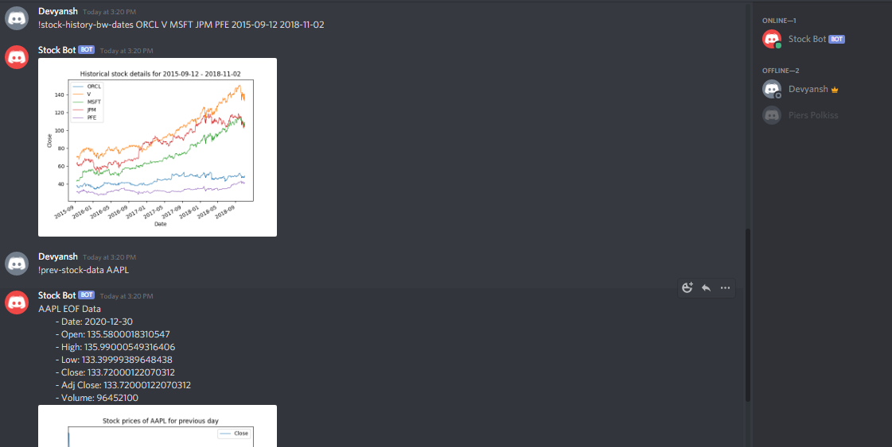

### Discord Stock Bot

 Stock Bot is created with an intent to reduce a trader’s dependency on manual efforts and help them analyze the market with automated updates and brief commands.

 ### Glimpses of the Bot in action

 
 

  The bot is designed for the Discord platform that provides us information about stocks of various companies in the form of messages in discord channels.

  It supports the following functionalities:
  - Provides hourly (between 1030 and 1630 IST, Mon-Fri) and daily stock updates (at 0700 IST, Mon-Fri).

  - Supports six query commands:
    - **!get-list**: Shows the list of companies for which stock data can be fetched by the bot.

    - **!prev-stock-data**: Shows the stock details of a company for the previous day. Multiple arguments would give the same result as the single argument. 
    Synopsis: !prev-stock-data *company_name* 

    - **!daily-trade-updates**: Shows the latest stock details of a company. Multiple arguments would give the same result as the single argument. 
    Synopsis: !daily-trade-updates *company_name*

    - **!stock-history**: Shows the entire historical stock details of a company(s). Multiple arguments are allowed for stock details of multiple companies. 
    Synopsis: !stock-history *company_name_1* *company_name_2* *...*

    - **!stock-history-bw-dates**: Shows the historical stock details of a company(s) in the specified date interval. Multiple arguments are allowed for stock details of multiple companies. 
    Synopsis: !stock-history *company_name_1* *company_name_2* *...* *start_date* *end_date* 
    Dates are to be in the format YYYY-MM-DD.

    - **!create-channel**: It creates a new text channel in Discord. The user must have admin role for this command to work. 
    Synopsis: !create-channel *channel_name*

    NOTE: The stock data is fetched from Yahoo Finance API. The stock details of all companies for the present day are made available gradually. Thus, latest stock info could mean either stock info for the present day or the day before, taking into account the fact that stock market generally stays open from Monday through Friday. Similarly for the previous day stock info.

    ### References
    https://www.crio.do/projects/python-discord-bot/

    
